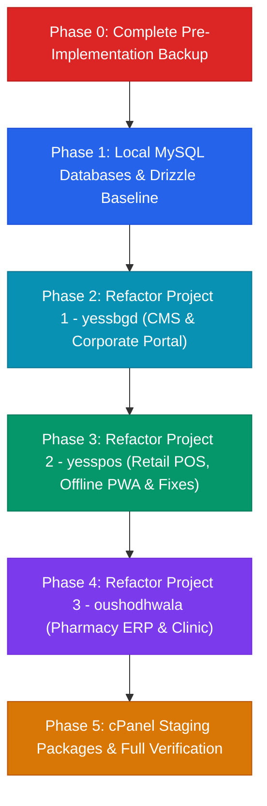

# 🚀 Full-Stack Migration Plan: Next.js 16 + MySQL (Drizzle ORM) for YessBangla Ecosystem

## Executive Summary
This implementation plan establishes the architectural blueprint for migrating the **YessBangla** ecosystem—comprising **`oushodhwala`**, **`yessbgd`**, and **`yesspos`**—from **TanStack Start (Vite) + Supabase (PostgreSQL)** to **Next.js 16 (App Router) + MySQL (Drizzle ORM)**.

### Core Guiding Principles
1. **Mandatory Pre-Implementation Backup**: Before making any modifications, all existing repositories will be completely duplicated to a dedicated backup directory (`/home/syed/workspace/YessBangla_backups/pre_migration_backup/`).
2. **Three Completely Independent Standalone Projects**: Each application is architected, configured, deployed, and maintained as a **100% self-contained, standalone project**:
   - Distinct package dependencies, configurations (`next.config.ts`, `drizzle.config.ts`), and environment variables.
   - Dedicated, isolated MySQL databases (`oushodhwala_db`, `yessbgd_db`, `yesspos_db`).
   - Independent cPanel deployment targets (separate subdomains/domains, application roots, and Phusion Passenger processes).
   - Zero monorepo coupling or shared runtime dependencies.
3. **Zero Visual Regressions**: The user-facing design, layout, color tokens, animations, fonts, and interaction states (Bangla/English bilingual toggles, thermal receipt iframe driver, barcode generation, dynamic CMS previews, and liquid glass water canvas) **must remain 100% identical**.

---

## Phase 0: Pre-Implementation Full Backup

Before executing any migrations or altering source files, a byte-for-byte backup of the entire ecosystem will be generated outside the active project tree.

### 0.1 Backup Execution Plan
```bash
# 1. Create dedicated backup directory outside active repository
mkdir -p /home/syed/workspace/YessBangla_backups/pre_migration_backup

# 2. Duplicate all three complete project repositories
cp -a /home/syed/workspace/YessBangla/oushodhwala /home/syed/workspace/YessBangla_backups/pre_migration_backup/
cp -a /home/syed/workspace/YessBangla/yessbgd /home/syed/workspace/YessBangla_backups/pre_migration_backup/
cp -a /home/syed/workspace/YessBangla/yesspos /home/syed/workspace/YessBangla_backups/pre_migration_backup/

# 3. Create a compressed archival snapshot
tar -czf /home/syed/workspace/YessBangla_backups/YessBangla_pre_nextjs_migration_$(date +%Y%m%d_%H%M%S).tar.gz -C /home/syed/workspace/YessBangla oushodhwala yessbgd yesspos
```

### 0.2 Backup Verification Checklist
- [ ] Confirm file count and byte size of original vs. backup directories match.
- [ ] Verify Git histories (`.git`) and `.env` files are preserved in the backup.
- [ ] Validate archive checksum.

---

## 1. Project Independence & Architecture Matrix

Each of the three projects operates with total autonomy:

| Specification | Project 1: `oushodhwala` | Project 2: `yessbgd` | Project 3: `yesspos` |
| :--- | :--- | :--- | :--- |
| **Domain Scope** | E-Pharmacy, Clinical Services, ERP | Corporate Portal, CMS, Document Engine | Retail Point of Sale, PWA, Accounting |
| **Package Identity** | `@yessbangla/oushodhwala` | `@yessbangla/portal` | `@yessbangla/pos` |
| **Framework** | Next.js 16 (App Router) + React 19 | Next.js 16 (App Router) + React 19 | Next.js 16 (App Router) + React 19 |
| **Styling** | Tailwind CSS v4 (`@tailwindcss/postcss`) | Tailwind CSS v4 (`@tailwindcss/postcss`) | Tailwind CSS v4 (`@tailwindcss/postcss`) |
| **Isolated MySQL DB** | `oushodhwala_db` (port 3306) | `yessbgd_db` (port 3306) | `yesspos_db` (port 3306) |
| **Auth Strategy** | HTTP-Only JWT (Patient, Staff, Admin) | HTTP-Only JWT (Editor, Admin) | HTTP-Only JWT (Cashier, Manager, Admin)|
| **cPanel App Root** | `public_html/oushodhwala` | `public_html/yessbgd` (or root) | `public_html/yesspos` |
| **cPanel URL/Domain**| e.g. `pharmacy.yessbd.com` | e.g. `yessbd.com` | e.g. `pos.yessbd.com` |
| **Special Features** | Rx Upload, AI Chat with Rate-Limit | Liquid Glass, Word/PDF Exporter | Thermal Print, Offline IndexedDB, Barcode|

---

## 2. Remediation of Security Vulnerabilities & Technical Debt

All findings documented in [`COMPREHENSIVE_CODEBASE_REVIEW.md`](file:///home/syed/workspace/YessBangla/COMPREHENSIVE_CODEBASE_REVIEW.md) will be strictly remediated inside each independent project:

| Issue Identified | Target Repo | Severity | Independent Remediation Strategy |
| :--- | :--- | :--- | :--- |
| **Super Admin Password Reset Backdoor** | `yesspos` | 🚨 **CRITICAL** | Completely delete `src/lib/auth-recovery.functions.ts`. Reset passwords only through authenticated admin actions or verified database seeding. |
| **Cashier Role Escalation on Signup** | `yesspos` | 🚨 **CRITICAL** | Customer storefront signups default to role `'customer'`. Staff roles (`cashier`, `manager`, `admin`) are strictly provisioned by Super Admins. |
| **Permissive RLS Policies on Ledgers/Purchases**| `yesspos` | 🔴 **HIGH** | Replace client-side Supabase calls with Next.js Server Actions enforcing `requireRole(["admin", "manager"])`. |
| **Unauthenticated Public AI Scraping** | `oushodhwala` | 🔴 **HIGH** | Implement IP-based rate limiting and captcha/session validation on `askSupportGuest`. |
| **DOCX HTML XSS Injection** | `yessbgd` | 🔴 **HIGH** | Wrap `mammoth.convertToHtml` output with `DOMPurify.sanitize()` before passing to `dangerouslySetInnerHTML`. |
| **Dead Weight Dependency (`three.js`)** | `yessbgd` | 🟡 **MEDIUM** | Remove `three` and `@types/three` from `package.json` (WaterBackground uses native 2D Canvas). |
| **Lingering Python Patch Scripts** | `oushodhwala` | 🔵 **LOW** | Delete the 9 unused Python scripts (`update_medicines_v*.py`, etc.) from the root. |
| **Duplicate Package Names** | All 3 | 🔵 **LOW** | Set unique names in each `package.json`: `@yessbangla/oushodhwala`, `@yessbangla/portal`, and `@yessbangla/pos`. |
| **Git-Tracked `.env` Files** | All 3 | 🟡 **MEDIUM** | Remove `.env` from Git cache, add to `.gitignore`, provide `.env.example` in each repo. |

---

## 3. Database Layer: Isolated MySQL Databases via Drizzle ORM

### 3.1 Local XAMPP & cPanel Database Setup
Each project connects to its own independent MySQL database:
```sql
-- Local XAMPP MySQL (Running on port 3306)
CREATE DATABASE IF NOT EXISTS `oushodhwala_db` CHARACTER SET utf8mb4 COLLATE utf8mb4_unicode_ci;
CREATE DATABASE IF NOT EXISTS `yessbgd_db` CHARACTER SET utf8mb4 COLLATE utf8mb4_unicode_ci;
CREATE DATABASE IF NOT EXISTS `yesspos_db` CHARACTER SET utf8mb4 COLLATE utf8mb4_unicode_ci;
```
In cPanel, separate databases and users will be provisioned per project (e.g. `cpaneluser_oushodhwala`, `cpaneluser_yessbgd`, `cpaneluser_yesspos`).

### 3.2 High-Performance Connection Pooling Singleton
Implemented per project in `src/lib/db/index.ts`:

```typescript
// src/lib/db/index.ts (Independent per project)
import { drizzle } from "drizzle-orm/mysql2";
import mysql from "mysql2/promise";
import * as schema from "./schema";

const globalForDb = globalThis as unknown as {
  conn: mysql.Pool | undefined;
};

const pool =
  globalForDb.conn ??
  mysql.createPool({
    uri: process.env.DATABASE_URL,
    waitForConnections: true,
    connectionLimit: process.env.NODE_ENV === "production" ? 10 : 5,
    queueLimit: 0,
    enableKeepAlive: true,
    keepAliveInitialDelay: 10000,
  });

if (process.env.NODE_ENV !== "production") {
  globalForDb.conn = pool;
}

export const db = drizzle(pool, { schema, mode: "default" });
```

### 3.3 Atomic Transactions (Replacing Supabase RPCs)
Multi-table operations (e.g., POS checkout, inventory decrement, journal entries) run inside ACID Drizzle transactions:

```typescript
// Example: src/actions/pos.ts in yesspos
"use server";
import { db } from "@/lib/db";
import { sales, saleItems, productStock } from "@/lib/db/schema";
import { eq, sql } from "drizzle-orm";

export async function createSaleAction(payload: SalePayload) {
  return await db.transaction(async (tx) => {
    const [saleResult] = await tx.insert(sales).values({ ...payload });
    const saleId = saleResult.insertId;

    for (const item of payload.items) {
      await tx.insert(saleItems).values({ saleId, ...item });
      await tx
        .update(productStock)
        .set({ stock: sql`${productStock.stock} - ${item.qty}` })
        .where(eq(productStock.productId, item.productId));
    }
    return { success: true, saleId };
  });
}
```

---

## 4. Next.js 16 App Router Patterns & UI Parity

### 4.1 Next.js 16 Async API Standard
In accordance with Next.js 16 conventions:
- **Dynamic Params**: `const { id } = await params;`
- **Search Params**: `const { query } = await searchParams;`
- **Request Headers & Cookies**: `const cookieStore = await cookies();`
- **Server Actions**: Direct form action and mutation invocation with `useTransition` and `useActionState`.

### 4.2 Tailwind CSS v4 in Next.js 16
Preserve all CSS tokens, themes, and animations:
- `postcss.config.mjs`:
  ```javascript
  export default {
    plugins: {
      "@tailwindcss/postcss": {},
    },
  };
  ```
- `src/app/globals.css`:
  ```css
  @import "tailwindcss";
  /* All existing custom variables, animations, and HSL tokens remain untouched */
  ```

### 4.3 Standalone Build Configuration (`next.config.ts`)
```typescript
import type { NextConfig } from "next";

const nextConfig: NextConfig = {
  output: "standalone",
  images: {
    unoptimized: true, // Crucial for cPanel shared hosting compatibility
  },
  experimental: {
    serverActions: {
      bodySizeLimit: "10mb",
    },
  },
};

export default nextConfig;
```

---

## 5. cPanel Cloud Hosting Deployment Pipeline

### 5.1 Architecture on cPanel
```
cPanel Host (yesshost-cpanel.eastasia.cloudapp.azure.com)
  ├── MySQL 8.0 Databases (oushodhwala_db, yessbgd_db, yesspos_db)
  ├── Apache Web Server + SSL
  │    └── Individual .htaccess files per project document root
  └── Phusion Passenger (cPanel "Setup Node.js App")
       ├── App 1: oushodhwala (server.js on Assigned Port A)
       ├── App 2: yessbgd     (server.js on Assigned Port B)
       └── App 3: yesspos     (server.js on Assigned Port C)
```

### 5.2 Standalone Packaging Script (`scripts/package-cpanel.mjs`)
Each repository will feature an independent packaging script:
```javascript
// scripts/package-cpanel.mjs
import { cpSync, existsSync, mkdirSync } from "node:fs";

console.log("Packaging standalone build for cPanel...");
if (!existsSync(".next/standalone")) throw new Error("Run next build first!");

cpSync("public", ".next/standalone/public", { recursive: true });
cpSync(".next/static", ".next/standalone/.next/static", { recursive: true });
console.log("✅ Standalone bundle prepared successfully.");
```

### 5.3 Phusion Passenger Startup Entry (`server.js`)
```javascript
// server.js (Application Startup File for cPanel)
const { createServer } = require("http");
const { parse } = require("url");
const next = require("next");

const dev = false;
const app = next({ dev, dir: __dirname });
const handle = app.getRequestHandler();
const port = process.env.PORT || 3000;

app.prepare().then(() => {
  createServer((req, res) => {
    const parsedUrl = parse(req.url, true);
    handle(req, res, parsedUrl);
  }).listen(port, () => {
    console.log(`> Standalone production server listening on port ${port}`);
  });
});
```

### 5.4 Apache `.htaccess` Configuration
```apache
<IfModule mod_rewrite.c>
  RewriteEngine On
  RewriteBase /
  RewriteRule ^uploads/(.*)$ public/uploads/$1 [L]
  RewriteCond %{REQUEST_FILENAME} !-f
  RewriteRule ^(.*)$ http://127.0.0.1:3000/$1 [P,L]
</IfModule>
```

---

## 6. Phased Implementation Roadmap



### Phase 0: Complete Pre-Implementation Backup
1. Create backup directory `/home/syed/workspace/YessBangla_backups/pre_migration_backup/`.
2. Fully clone all 3 active projects into the backup destination preserving git tracking.
3. Generate a compressed tarball archive for disaster recovery.

### Phase 1: Local Foundation & Database Initialization
1. Verify local XAMPP MySQL daemon (`/opt/lampp/bin/mysql -u root`).
2. Create databases: `oushodhwala_db`, `yessbgd_db`, and `yesspos_db`.
3. Test connectivity with Drizzle connection pools.

### Phase 2: Refactor `yessbgd` (Corporate Portal & Dynamic CMS)
1. Initialize Next.js 16 App Router in `yessbgd`.
2. Define Drizzle MySQL schema (`cms_site_pages`, `cms_ventures`, `cms_services`, `cms_insights`, `contact_messages`, `job_applications`).
3. Migrate bilingual `i18next` engine and liquid glass water canvas.
4. Integrate `DOMPurify` for secure DOCX preview in `ProfilePreviewDialog.tsx`.
5. Remove unused `three.js` dependency.
6. Verify design parity against original site.

### Phase 3: Refactor `yesspos` (Retail POS, Hardware & Offline PWA)
1. Initialize Next.js 16 App Router in `yesspos`.
2. Define Drizzle MySQL schema for sales, inventory, double-entry ledgers, and delivery riders.
3. **Security Fixes**: Permanently delete `resetSuperAdminPassword` backdoor and set customer signup role to `'customer'`.
4. Migrate ESC/POS thermal printing engine (`print.ts`), barcode generation, and IndexedDB offline queue.
5. Implement atomic `createSaleAction` in Drizzle transactions.
6. Verify POS terminal and billing workflows.

### Phase 4: Refactor `oushodhwala` (Pharmacy & Healthcare ERP)
1. Initialize Next.js 16 App Router in `oushodhwala`.
2. Define modular Drizzle schema for medicines, stock batches, orders, prescriptions, doctors, and ERP finance.
3. Split the monolithic 1,787-line `admin.tsx` into modular Next.js routes (`/admin/inventory`, `/admin/orders`, `/admin/rx`, `/admin/pos`, etc.).
4. Migrate doctor consultations, home diagnostics, and prescription management.
5. Add server-side rate limiting to public AI support endpoints.
6. Purge leftover Python scripts from root.

### Phase 5: Verification & cPanel Deployment Package
1. Run local verification against XAMPP MySQL.
2. Perform test builds (`npm run build`) in each project to ensure zero TypeScript errors.
3. Package standalone deployment zips with `server.js` and `.htaccess` for cPanel.
4. Synchronize databases and verify live operational readiness.

---

## 7. Verification & Parity Checklist

- [ ] **Backup Integrity**: Pre-implementation backup verified in `/home/syed/workspace/YessBangla_backups/`.
- [ ] **Project Independence**: Each repo builds independently with zero cross-repo imports.
- [ ] **UI & Styling**: Pixel-perfect match with existing Tailwind CSS v4 design.
- [ ] **Bilingual Support**: Instant switching between Bangla and English across all routes.
- [ ] **Hardware Printing**: Thermal 58mm/80mm and A4 receipts generate properly in POS.
- [ ] **Database Integrity**: All foreign keys, cascade deletes, and transaction rollbacks operate with zero data loss on MySQL.
- [ ] **Security Audits**: Backdoors removed, signup escalation eliminated, and DOCX HTML previews sanitized.
- [ ] **cPanel Compatibility**: Standalone bundle starts seamlessly under Phusion Passenger.
