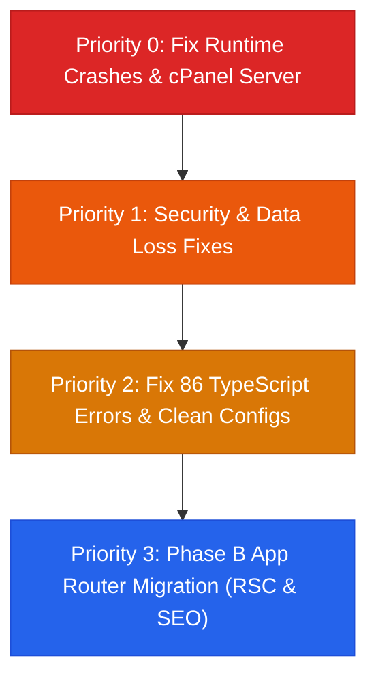

# 🏛️ Comprehensive Codebase & Database Review: YessBD (`yessbgd`)

**Project**: `@yessbangla/portal` (Corporate Portal & Dynamic CMS)  
**Location**: `/home/syed/workspace/YessBangla/yessbgd`  
**Date of Audit**: September 21, 2026  
**Stack**: Next.js 16.3.5 (App Router) + React 19 + Tailwind CSS v4 + MySQL (Drizzle ORM) + Auth.js v5  
**Target Deployment**: cPanel Shared Hosting + Phusion Passenger  

---

## Executive Summary & System Health

An exhaustive audit of the `yessbgd` repository was conducted following the recent migration from TanStack Start + Supabase to Next.js 16 + MySQL (Drizzle ORM).

While standard compilation (`npm run build`) appears green on the surface, this is only because **`typescript.ignoreBuildErrors: true`** is masking **86 TypeScript errors across 25 files**. Beneath the surface, the application suffers from **critical runtime exceptions on all dynamic routes, a broken standalone cPanel server entry, public exposure of applicant PII/resumes, unrestricted file upload, path traversal vulnerabilities, and silent data loss in the CMS for Bengali translations**.

### Health Matrix

| Dimension | Status | Summary Finding |
| :--- | :---: | :--- |
| **cPanel Standalone Build** | 🔴 **Broken** | `package-cpanel.mjs` overwrites Next.js's ES module `server.js` with CommonJS code, crashing immediately on startup (`ReferenceError: require is not defined`). |
| **Dynamic Routing** | 🔴 **Broken** | All dynamic routes (`/ventures/[slug]`, `/services/[slug]`, `/careers/[slug]`, etc.) call `Route.useLoaderData()`, which is undefined in the compat shim, throwing fatal runtime exceptions. |
| **Layout & Navigation** | 🔴 **Broken** | `useLocation()` in `router-compat.tsx` ignores `{ select }`, returning an object to `Header` and `MobileTabBar`, causing `pathname.startsWith is not a function` runtime crashes. |
| **File Storage & Security** | 🔴 **Critical** | Candidate resumes containing sensitive PII are saved in `public/uploads/resumes/` where anyone can download them without authentication. No MIME or extension check on uploads. |
| **Path Traversal Security** | 🔴 **Critical** | `deleteMediaAction` and `deleteApplicationsAction` execute `unlink` on unsanitized user-supplied paths without `..` traversal checks. |
| **CMS Data Integrity** | 🔴 **High** | `upsertCmsRecordAction` omits all Bengali fields (`nameBn`, `tagBn`, `summaryBn`, `descriptionBn`), silently dropping all Bengali content when saved in Admin CMS. |
| **TypeScript Strictness** | 🟡 **Failing** | 86 compilation errors across 25 files masked by `ignoreBuildErrors: true`. `fail()` in `cms.ts` breaks type narrowing across all actions. |
| **NextAuth / Auth.js** | 🟡 **Unstable** | `adapter: DrizzleAdapter(db) as any` configured with JWT strategy, but Drizzle schema lacks NextAuth adapter tables (`accounts`, `sessions`, `verificationTokens`). |
| **SEO & Social Sharing** | 🟡 **Degraded** | All pages are `"use client"` wrappers; TanStack `Route.head` / `Route.loader` are completely ignored by Next.js, dropping all JSON-LD and OpenGraph metadata. |
| **CI/CD & Tooling** | 🔴 **Broken** | `.github/workflows/a11y.yml` references deleted `bun.lockb` and missing npm scripts; `eslint.config.js` fails with missing modules; unit tests depend on missing `bun:test`. |

---

## 1. 🚨 Critical Issues: Deployment Blockers & Runtime Crashes

### 1.1 Broken Standalone Production Server (`ReferenceError: require is not defined`)
- **File**: [`scripts/package-cpanel.mjs:30-49`](./scripts/package-cpanel.mjs)
- **Code**:
  ```javascript
  // Phusion Passenger startup entry for cPanel Node.js App
  const { createServer } = require("http");
  const { parse } = require("url");
  const next = require("next");
  // ...
  writeFileSync(resolve(standaloneDir, "server.js"), serverJsContent, "utf8");
  ```
- **Finding**:
  1. `next build` with `output: "standalone"` outputs a pre-bundled, self-contained ES module server file at `.next/standalone/server.js` using `startServer` from Next.js internals.
  2. `package-cpanel.mjs` completely **overwrites** this generated `server.js` with CommonJS code (`require("http")`, `require("next")`).
  3. Because `package.json` declares `"type": "module"`, running `node server.js` immediately crashes:
     ```
     ReferenceError: require is not defined in ES module scope, you can use import instead
     ```
  4. Furthermore, standalone builds do not ship the complete Next.js compiler/dev runtime required by `next({ dev, dir: __dirname })`.
- **Impact**: Any deployment to cPanel using `npm run build:cpanel` will fail to start under Phusion Passenger or Node.js.
- **Fix**: Remove the file overwriting logic in `scripts/package-cpanel.mjs`. Allow Next.js's native standalone `server.js` to run as intended.

---

### 1.2 Fatal Runtime Exceptions on All Dynamic Detail Pages (`Route.useLoaderData is not a function`)
- **Files Affected**:
  1. [`src/routes/ventures.$slug.tsx:129`](./src/routes/ventures.$slug.tsx): `const { venture: staticVenture } = Route.useLoaderData();`
  2. [`src/routes/services.$slug.tsx:44`](./src/routes/services.$slug.tsx): `const { service: staticService } = Route.useLoaderData();`
  3. [`src/routes/industries.$slug.tsx:44`](./src/routes/industries.$slug.tsx): `const { industry: staticIndustry } = Route.useLoaderData();`
  4. [`src/routes/careers.$slug.tsx:121`](./src/routes/careers.$slug.tsx): `const { job } = Route.useLoaderData();`
  5. [`src/routes/insights.$slug.tsx:86`](./src/routes/insights.$slug.tsx): `const { post: staticPost } = Route.useLoaderData();`
  6. [`src/routes/about.$pillar.tsx:43`](./src/routes/about.$pillar.tsx): `const { pillar: staticPillar } = Route.useLoaderData();`
- **Root Cause**:
  In [`src/lib/router-compat.tsx:139-146`](./src/lib/router-compat.tsx), `createFileRoute` returns:
  ```typescript
  export function createFileRoute(_path: string) {
    return (options: any) => ({ ...options, path: _path });
  }
  ```
  `Route` does **not** expose a `useLoaderData` hook.
- **Impact**: When any visitor navigates to `/ventures/[slug]` (e.g. `/ventures/yess-soft`), `/services/[slug]`, `/careers/[slug]`, `/industries/[slug]`, or `/insights/[slug]`, the page crashes with `TypeError: Route.useLoaderData is not a function`. Because these are dynamic routes rendered on-demand, this crash only occurs at request time, escaping build-time detection.

---

### 1.3 Fatal Runtime Exceptions on Search Param Pages (`Route.useSearch is not a function`)
- **Files Affected**:
  1. [`src/routes/application-status.tsx:111`](./src/routes/application-status.tsx): `const sp = Route.useSearch();`
  2. [`src/routes/admin.pages.$page.tsx:87`](./src/routes/admin.pages.$page.tsx): `const { tab: tabFromUrl } = Route.useSearch();`
- **Root Cause**: `createFileRoute` in `router-compat.tsx` does not attach `useSearch`.
- **Impact**: Navigating to `/application-status` (the job application tracking portal) or opening an admin page editor crashes with `TypeError: Route.useSearch is not a function`.

---

### 1.4 Global Navigation Crash (`pathname.startsWith is not a function`)
- **Files Affected**:
  - [`src/components/Header.tsx:353-354`](./src/components/Header.tsx):
    ```typescript
    const pathname = useLocation({ select: (l) => l.pathname });
    const venturesActive = pathname === "/ventures" || pathname.startsWith("/ventures/") || pathname === "/projects";
    ```
  - [`src/components/MobileTabBar.tsx:31, 47`](./src/components/MobileTabBar.tsx):
    ```typescript
    const pathname = useLocation({ select: (l) => l.pathname });
    // line 47:
    matches.some((m) => pathname === m || pathname.startsWith(m + "/"));
    ```
  - [`src/components/RouteTransition.tsx:10`](./src/components/RouteTransition.tsx)
- **Root Cause**:
  In [`src/lib/router-compat.tsx:65-76`](./src/lib/router-compat.tsx), `useLocation()` accepts zero arguments:
  ```typescript
  export function useLocation() {
    const pathname = usePathname() || "/";
    const searchParams = useSearchParams();
    const searchStr = searchParams?.toString() || "";
    return { pathname, href: searchStr ? `${pathname}?${searchStr}` : pathname, search: ..., searchStr, hash: "" };
  }
  ```
  It ignores the `{ select: (l) => l.pathname }` selector. `pathname` becomes the full location object `{ pathname: "...", ... }`.
- **Impact**: Calling `pathname.startsWith(...)` crashes with `TypeError: pathname.startsWith is not a function` on every page using `Header` and `MobileTabBar`.

---

## 2. 🔴 High Severity Security Vulnerabilities

### 2.1 Public Unauthenticated Exposure of Sensitive Candidate Resumes
- **Location**: [`src/actions/public.ts:120-128`](./src/actions/public.ts)
- **Code**:
  ```typescript
  const uploadsDir = path.join(process.cwd(), "public", "uploads", "resumes");
  await mkdir(uploadsDir, { recursive: true });
  const safeName = resume.name.replace(/[^a-zA-Z0-9._-]/g, "_").slice(0, 120);
  const fileName = `${Date.now()}-${safeName}`;
  const absPath = path.join(uploadsDir, fileName);
  await writeFile(absPath, buffer);
  ```
- **Vulnerability**:
  Resumes are written directly to `public/uploads/resumes/`. The Next.js static asset server and Apache serve files in `public/` directly without any authentication check.
  Although an authenticated admin endpoint was created at [`src/app/api/admin/resumes/[...path]/route.ts`](./src/app/api/admin/resumes/%5B...path%5D/route.ts), it is rendered useless because anyone who knows or enumerates the timestamp prefix can issue `GET /uploads/resumes/<timestamp>-resume.pdf` and directly view or download confidential resumes containing applicant names, phone numbers, email addresses, and employment records.
- **Remediation**:
  Store uploaded resumes outside the web-accessible root (e.g. `storage/resumes/` in the project root) and serve them exclusively through the authenticated `/api/admin/resumes/` endpoint.

---

### 2.2 Unrestricted File Upload in Job Application Form
- **Location**: [`src/actions/public.ts:113-118`](./src/actions/public.ts)
- **Code**:
  ```typescript
  if (!(resume instanceof File) || resume.size === 0) {
    return { ok: false, error: "Resume file is required", status: 400 };
  }
  if (resume.size > 5 * 1024 * 1024) {
    return { ok: false, error: "Resume must be under 5MB", status: 400 };
  }
  ```
- **Vulnerability**:
  There is **zero validation** of file extensions, MIME types, or magic bytes.
- **Risk**: An attacker can upload `.html`, `.svg` (containing JavaScript payloads for Stored XSS), `.php` scripts, or executable payloads directly into `public/uploads/resumes/`. If Apache on cPanel executes PHP inside the uploads directory, this enables full Remote Code Execution (RCE).
- **Remediation**:
  Validate file extensions (allow only `.pdf`, `.docx`, `.doc`), inspect MIME types, verify file magic headers, and configure Apache `.htaccess` in the uploads folder with `php_flag engine off` and `RemoveHandler .php`.

---

### 2.3 Path Traversal / Arbitrary File Deletion
- **Locations**:
  - [`src/actions/media.ts:74-81`](./src/actions/media.ts) (`deleteMediaAction`)
    ```typescript
    if (input.path) {
      const abs = path.join(process.cwd(), "public", "uploads", input.path);
      try { await unlink(abs); } catch { /* ... */ }
    }
    ```
  - [`src/actions/cms.ts:862`](./src/actions/cms.ts) (`deleteApplicationsAction`)
    ```typescript
    await unlink(path.join(process.cwd(), "public", r.resumePath.replace(/^\//, "")));
    ```
- **Vulnerability**:
  `input.path` is joined without checking for directory traversal sequences (`..`).
- **Risk**: An editor or compromised account can pass `input.path = "../../server.js"` or `../../../package.json` to delete arbitrary files on the host filesystem.
- **Remediation**:
  Resolve the path and verify `abs.startsWith(path.join(process.cwd(), "public", "uploads"))` before calling `unlink()`.

---

### 2.4 Candidate PII Enumeration via Application Status
- **Location**: [`src/actions/public.ts:242-247`](./src/actions/public.ts)
- **Code**:
  ```typescript
  const [row] = await db
    .select()
    .from(jobApplications)
    .where(eq(jobApplications.email, email))
    .limit(1);
  return { ok: true, data: row ? mapRow(row) : null };
  ```
- **Vulnerability**:
  While the frontend form enforces both an email and a 4-character Reference Code (`ref`), the server-side action allows `ref` to be completely omitted. Providing only an email returns the applicant's full name, job title applied for, and application status.
- **Risk**: Attackers can run automated email lists against `lookupApplicationAction` with no rate limiting to discover which individuals have applied for jobs at YESS Bangla.
- **Remediation**:
  Enforce that `ref` or `applicationId` is mandatory in `lookupApplicationAction`, and apply IP/session rate limiting.

---

### 2.5 Client-Side Only Brute-Force Throttling on Admin Login
- **Location**: [`src/routes/admin.login.tsx:23-50`](./src/routes/admin.login.tsx)
- **Vulnerability**:
  The admin login brute-force lock (`yb_admin_login_guard`) is stored solely in the user's browser `localStorage`.
- **Risk**: Automated credential-stuffing tools or attackers sending POST requests directly to `/api/auth/callback/credentials` bypass this protection entirely.
- **Remediation**:
  Implement server-side IP/account throttling in NextAuth's `authorize` callback or middleware.

---

## 3. 💾 Database Architecture & Data Integrity Issues

### 3.1 Silent Data Loss in CMS Admin (Bengali Content Dropped)
- **Locations**: [`src/routes/admin.cms.$type.$id.tsx:161`](./src/routes/admin.cms.$type.$id.tsx) & [`src/actions/public.ts:271-322`](./src/actions/public.ts)
- **Problem**:
  When editing ventures, services, or industries in the admin panel, the UI sends payload data to `upsertCmsRecordAction` in `src/actions/public.ts`.
  Inside `mapCmsPayload`:
  ```typescript
  case "ventures":
    return {
      slug: str("slug") || `item-${Date.now()}`,
      name: str("title") || str("name") || "Untitled",
      tag: str("tagline") || str("tag"),
      category: str("category") || "tech",
      status: str("status") || "active",
      summary: str("description"),
      description: str("description"),
      heroImage: str("image_path"),
      sortOrder: num("sort_order"),
      metrics: (data.data as Record<string, unknown>) || {},
      isFeatured: bool("is_published"),
    };
  ```
  The mapper **completely ignores** `nameBn`, `tagBn`, `summaryBn`, `descriptionBn`, `logoImage`, and `linkUrl`.
- **Impact**: Any Bengali translations entered by administrators are silently erased on save.
- **Fix**: Align `mapCmsPayload` to map all schema fields, including all `*Bn` bilingual columns.

---

### 3.2 Missing Full Schema Initialization DDL Script
- **Problem**:
  - [`scripts/migrate-remaining.sql`](./scripts/migrate-remaining.sql) contains only `CREATE TABLE IF NOT EXISTS cms_pages` and a few `ALTER TABLE` statements.
  - [`scripts/seed.sql`](./scripts/seed.sql) assumes all tables already exist and executes only `INSERT INTO` queries.
  - The `drizzle/` directory does not exist.
- **Impact**: When deploying to a clean cPanel MySQL database or a fresh local XAMPP environment, there is no SQL script to create the initial database schema (`users`, `profiles`, `user_roles`, `cms_site_pages`, `cms_ventures`, `cms_services`, `cms_industries`, `cms_insights`, `cms_menu_items`, `cms_media`, `cms_settings`, `contact_messages`, `job_applications`, `audit_logs`).
- **Fix**: Export a complete `scripts/schema.sql` file containing all `CREATE TABLE` DDL statements matching [`src/db/schema.ts`](./src/db/schema.ts).

---

### 3.3 NextAuth / Auth.js Adapter Incompatibility
- **Location**: [`src/auth.ts:10-11`](./src/auth.ts)
- **Problem**:
  ```typescript
  adapter: DrizzleAdapter(db) as any,
  session: { strategy: "jwt" },
  ```
  The `@auth/drizzle-adapter` expects specific tables (`accounts`, `sessions`, `verificationTokens`) and fields on `users` (`emailVerified`, `image`). None of these exist in `src/db/schema.ts`.
- **Impact**: Using `session: { strategy: "jwt" }` with `CredentialsProvider` does not require a database adapter. Leaving `adapter: DrizzleAdapter(db) as any` risks unexpected runtime database errors if Auth.js triggers adapter methods.
- **Fix**: Remove `adapter: DrizzleAdapter(db) as any` from `src/auth.ts`.

---

### 3.4 Inefficient N+1 Database Dumps in Data Backup
- **Location**: [`src/lib/dataBackup.ts:74, 101-117`](./src/lib/dataBackup.ts)
- **Problem**:
  In `buildBackup`, the code loops through 12 tables and calls `fetchTable(t, range)`. In turn, `fetchTable` calls `exportBackupTablesAction()`, which selects all 12 tables from the database.
- **Impact**: Clicking "Export" executes **12 full database dumps in a loop** (144 table queries), transferring the entire database payload 12 consecutive times to discard 11/12ths of the payload on each iteration.
- **Fix**: Call `exportBackupTablesAction()` once, and filter the returned dataset locally in memory.

---

## 4. 🛠️ TypeScript Compilation Errors (86 Errors Masked)

Running `npx tsc --noEmit` produces **86 compilation errors across 25 files**. These errors are currently hidden by `typescript: { ignoreBuildErrors: true }` in [`next.config.ts`](./next.config.ts).

### 4.1 Broken Type Narrowing via `fail()` Helper (20 Errors)
- **Location**: [`src/actions/cms.ts:30-39, 61, 94, 120, 168, 231, ...`](./src/actions/cms.ts)
- **Problem**:
  `fail(err: unknown): ActionResult` returns the union `ActionResult` (which defaults to `ActionResult<Record<string, unknown>>` including `{ ok: true }`). Because `{ ok: true } & Record<string, unknown>` is not assignable to `{ ok: true } & { role: ... }` or `{ ok: true } & { rows: ... }`, TypeScript rejects every action's catch block.
- **Fix**:
  Type `fail` as returning strictly an error result:
  ```typescript
  function fail(err: unknown): { ok: false; error: string; status: number } { ... }
  ```

---

### 4.2 `StaticImageData` vs `string` Type Mismatches
- **Locations**:
  - [`src/lib/ventureBrief.ts:126, 146`](./src/lib/ventureBrief.ts)
  - [`src/lib/ventureBriefDocx.ts:60, 71`](./src/lib/ventureBriefDocx.ts)
  - [`src/data/ventures.ts:891`](./src/data/ventures.ts)
  - [`src/lib/dynamicContent.ts:72`](./src/lib/dynamicContent.ts)
  - [`src/components/Header.tsx:304`](./src/components/Header.tsx)
  - [`src/components/Footer.tsx:39`](./src/components/Footer.tsx)
  - [`src/routes/index.tsx:763, 895, 927, 1031`](./src/routes/index.tsx)
  - [`src/routes/ventures.$slug.tsx:150, 1108`](./src/routes/ventures.$slug.tsx)
- **Problem**:
  In Next.js, static asset imports return `StaticImageData` objects (`{ src: string, height: number, width: number }`), not primitive strings.
  Code throughout the application passes `StaticImageData` directly into `fetch(logoUrl)` in PDF/DOCX generators (which throws at runtime), into `` (which renders `[object Object]` or fails typecheck), or returns it where `string[]` is expected.
- **Fix**: Access `.src` (e.g. `typeof logoUrl === "string" ? logoUrl : logoUrl.src`).

---

### 4.3 Comparison Logic Bug in `DevHydrationProbe.tsx`
- **Location**: [`src/components/DevHydrationProbe.tsx:20`](./src/components/DevHydrationProbe.tsx)
- **Code**:
  ```typescript
  if (!process.env.NODE_ENV !== "production") return null;
  ```
- **Problem**:
  `!process.env.NODE_ENV` evaluates to `false`. `false !== "production"` is always `true`. The component **never mounts or displays in development or production**.
- **Fix**: Change to `if (process.env.NODE_ENV === "production") return null;`.

---

### 4.4 Vite `?url` Syntax Not Supported
- **Locations**:
  - `src/lib/briefQaPreview.ts:84`: `import workerUrl from "pdfjs-dist/build/pdf.worker.min.mjs?url";`
  - `src/lib/briefVisualDiff.ts:154`: `import workerUrl from "pdfjs-dist/build/pdf.worker.min.mjs?url";`
  - `src/routes/__root.tsx:4`: `import stylesUrl from "../styles.css?url";`
- **Problem**: The `?url` import query is a Vite-specific feature that fails resolution under Next.js Turbopack and Webpack.

---

## 5. 🌐 Architecture & Next.js 16 Parity

### 5.1 Complete Absence of React Server Components (RSC) & SEO Meta
- **Location**: All files in `src/app/(public)/**/page.tsx`
- **Finding**:
  Every single page under `src/app/` begins with `"use client";` and re-exports `Route.component` from `src/routes/`.
  Next.js does **not** invoke TanStack Router's `Route.head` or `Route.loader`.
- **Consequence**:
  1. All dynamic SEO metadata (titles, descriptions, OpenGraph tags, JSON-LD schemas) declared in `src/routes/*.tsx` are discarded.
  2. The site serves generic fallback metadata from `src/app/layout.tsx` for all routes.
  3. No Server Components are utilized; all data fetching happens client-side via React Query or static file imports.

---

### 5.2 Dead TanStack Artifacts
The codebase contains leftover files from TanStack Start that are no longer used by Next.js:
1. [`src/routeTree.gen.ts`](./src/routeTree.gen.ts) (1,020 lines) — unused.
2. [`src/routes/__root.tsx`](./src/routes/__root.tsx) — unused.
3. [`src/routes/admin.tsx`](./src/routes/admin.tsx) — replaced by [`src/app/admin/layout.tsx`](./src/app/admin/layout.tsx).
4. [`wrangler.jsonc`](./wrangler.jsonc) — Cloudflare entrypoint, dead.
5. [`bunfig.toml`](./bunfig.toml) — dead Bun config.

---

### 5.3 Temporary Lovable Preview URLs in Production Metadata
- **Location**: [`src/app/layout.tsx:20, 30`](./src/app/layout.tsx)
- **Problem**:
  OpenGraph and Twitter images point to:
  `https://pub-bb2e103a32db4e198524a2e9ed8f35b4.r2.dev/ed7b0e70-8f21-4619-800d-49d37f1d5232/id-preview-...png`
- **Risk**: If the Lovable R2 storage bucket expires or is cleared, social sharing link previews will break across all platforms.

---

## 6. ⚙️ CI/CD, Tooling & Repository Hygiene

### 6.1 Broken GitHub Actions Workflow (`a11y.yml`)
- **Location**: [`.github/workflows/a11y.yml:18, 24-25`](./.github/workflows/a11y.yml)
- **Problem**:
  1. `run: bun install --frozen-lockfile` fails because `bun.lockb` was removed from the repository.
  2. `run: bun run check:typography` and `run: bun run check:contrast` fail because neither script exists in `package.json`.

---

### 6.2 Unit Tests Broken on Node / npm
- **Locations**: [`tests/unit/ventureBrief.test.ts:1`](./tests/unit/ventureBrief.test.ts) & [`tests/unit/menuLock.test.ts:1`](./tests/unit/menuLock.test.ts)
- **Problem**:
  Both test files import `{ describe, expect, test } from "bun:test"`. Since Bun is no longer used, these tests cannot run under Node.js or Vitest.

---

### 6.3 ESLint Module Resolution Crash
- **Location**: [`eslint.config.js:2-6`](./eslint.config.js)
- **Problem**:
  Running `npm run lint` or `npx eslint .` throws:
  ```
  Cannot find package 'eslint-plugin-prettier' imported from .../eslint.config.js
  ```
  `eslint-plugin-prettier`, `eslint-plugin-react-refresh`, and other plugins declared in `eslint.config.js` are missing from `package.json`.

---

### 6.4 Untracked User Uploads & Committed `.env`
1. `public/uploads/` is currently untracked. Any uploaded images or resumes will dirty the git index unless added to `.gitignore`.
2. `.env` is staged for deletion in git, but still exists on disk containing old Supabase keys (`namzvtkouxorpmnjmfjk.supabase.co`).

---

## 7. 📋 Prioritized Action Plan



### Priority 0: Fix Runtime Crashes & Deployment Blockers (Immediate)
1. **Fix `package-cpanel.mjs`**: Stop overwriting `.next/standalone/server.js`. Keep Next.js's native ESM server.
2. **Fix `src/lib/router-compat.tsx`**:
   - Add `useLoaderData()`, `useSearch()`, and `useParams()` hooks to `createFileRoute`.
   - Update `useLocation(opts?: { select?: (l: any) => any })` to support selectors, returning string `pathname` to `Header.tsx` and `MobileTabBar.tsx`.

### Priority 1: Security & Data Loss Fixes
1. **Secure Resume Uploads**:
   - Move resumes from `public/uploads/resumes/` to a private directory (`storage/resumes/`).
   - Restrict uploads to `.pdf`, `.docx`, `.doc` with MIME validation.
   - Enforce path sanitization to prevent directory traversal (`..`) in `deleteMediaAction` and `deleteApplicationsAction`.
2. **Protect Application Status**:
   - Make `ref` mandatory in `lookupApplicationAction` and add IP rate limiting.
3. **Fix Bengali CMS Data Loss**:
   - Update `upsertCmsRecordAction` in `src/actions/public.ts` to map all `*Bn` fields (`nameBn`, `tagBn`, `summaryBn`, `descriptionBn`, `logoImage`, `linkUrl`).
4. **Clean `src/auth.ts`**:
   - Remove `adapter: DrizzleAdapter(db) as any`.

### Priority 2: TypeScript & Tooling Cleanliness
1. **Fix `src/actions/cms.ts`**:
   - Update `fail(err)` to return strictly `{ ok: false, error: string, status: number }`.
2. **Resolve `StaticImageData` Errors**:
   - Unwrap `.src` before passing images to `fetch()` or `` in `ventureBrief.ts`, `ventures.ts`, etc.
3. **Fix `DevHydrationProbe.tsx`**:
   - Correct the boolean comparison bug on line 20.
4. **Switch `ignoreBuildErrors: false`**:
   - Verify `npx tsc --noEmit` passes cleanly.
5. **Repair Tooling**:
   - Update `.github/workflows/a11y.yml` to use standard npm scripts.
   - Align `eslint.config.js` with installed dependencies.
   - Create `scripts/schema.sql` with the complete baseline MySQL DDL.

### Priority 3: Architecture & Phase B Migration
1. **Restore SEO & Metadata**:
   - Migrate dynamic pages to App Router React Server Components (RSC) and implement `generateMetadata` for dynamic OpenGraph, Twitter, and JSON-LD schemas.
2. **Purge Dead Artifacts**:
   - Remove `src/routeTree.gen.ts`, `src/routes/__root.tsx`, `wrangler.jsonc`, and `bunfig.toml`.
