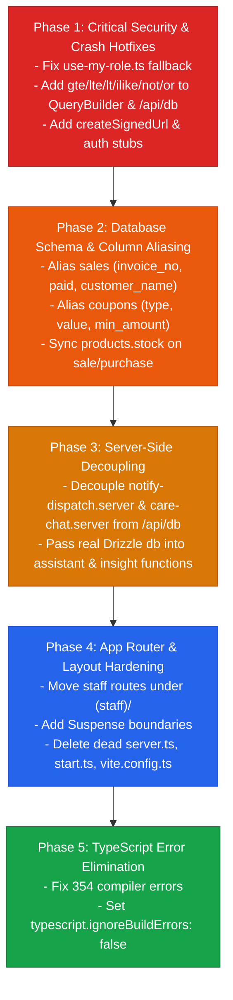

# 🏛️ Comprehensive Codebase & Database Review: YessPOS (`@yessbangla/pos`)

**Audit Date**: September 21, 2026  
**Target Repository**: `/home/syed/workspace/YessBangla/yesspos`  
**Current Tech Stack**: Next.js 16.3.5 (App Router / Turbopack) + React 19 + Auth.js v5 (`next-auth@5`) + MySQL 8.0 (Drizzle ORM) + Tailwind CSS v4  
**Target Deployment Environment**: cPanel Shared Cloud + Phusion Passenger (`standalone`) + MySQL

---

## 1. Executive Summary & Health Matrix

Following an exhaustive audit of the `yesspos` directory—benchmarked against [`implementation_plan.md`](../implementation_plan.md), [`COMPREHENSIVE_CODEBASE_REVIEW.md`](../COMPREHENSIVE_CODEBASE_REVIEW.md), and [`REMAINING_WORK.md`](../REMAINING_WORK.md)—the migration to Next.js 16 and MySQL has successfully established core standalone packaging and standalone Server Actions. However, **critical security vulnerabilities, severe runtime query builder exceptions, schema-to-UI column mismatches, and 354 TypeScript errors** remain unresolved.

| Area / Dimension | Status | Primary Risks & Findings |
| :--- | :--- | :--- |
| **Authentication & RBAC** | 🚨 **CRITICAL** | Client-side role fallback defaults to `cashier`; dummy auth middleware on server functions; hardcoded `@sherapos.local` legacy domains. |
| **Database Query Adapter** | 🚨 **CRITICAL** | `QueryBuilder` and `/api/db` lack `.gte()`, `.lte()`, `.lt()`, `.ilike()`, `.or()`, `.not()`, `.upsert()`, causing runtime crashes on POS checkout, Dashboard, Reports, and Financials. |
| **Schema & UI Alignment** | 🔴 **HIGH** | `sales` (`invoice_number` vs `invoice_no`, `paid_amount` vs `paid`, missing `customer_name`), `coupons` (`discount_type` vs `type`, `discount_value` vs `value`), and `product_stock` (`quantity` vs `stock`). |
| **Inventory Synchronization** | 🔴 **HIGH** | POS checkout and PO receiving update `product_stock.quantity` by branch, but never update `products.stock`. Storefront and AI bots read stale product stock. |
| **Storage & File Delivery** | 🔴 **HIGH** | `track.tsx` and `media.ts` invoke non-existent `createSignedUrl` on client storage; server-side functions perform relative `fetch('/api/db')` in Node.js. |
| **App Router Architecture** | 🟡 **MEDIUM** | `(staff)` route group layout is empty with no child pages; dynamic route segments (`/category/[slug]`, `/product/[id]`) ignore Next.js 16 async `params`. |
| **TypeScript Strictness** | 🟡 **MEDIUM** | 354 compiler errors across 58 files silenced by `typescript.ignoreBuildErrors: true`. |
| **Repository Hygiene** | 🔵 **LOW** | Dead TanStack Start server entries (`server.ts`, `start.ts`), `vite.config.ts`, and unused actions (`provisionStaffAction`). |

---

## 2. Security Vulnerabilities & Authentication Flaws

### 2.1 🚨 CRITICAL: Client-Side Default Role Escalation (`cashier`)
* **Location**: [`src/lib/use-my-role.ts:L20-L24`](file:///home/syed/workspace/YessBangla/yesspos/src/lib/use-my-role.ts#L20-L24)
* **Code**:
  ```ts
  const role =
    ((roleRows ?? []) as { role: AppRole }[])
      .map((r) => r.role)
      .sort((a, b) => APP_ROLES.indexOf(a) - APP_ROLES.indexOf(b))[0] ?? ("cashier" as AppRole);
  ```
* **Vulnerability**: When a customer signs up on the public storefront, no staff row is inserted into `user_roles`. Because line 23 falls back to `?? ("cashier" as AppRole)`, any logged-in retail customer is evaluated as a `cashier` in the browser.
* **Impact**: Front-end permission gates (`canAccess(role, feature)`) unlock access to the POS counter (`/pos`), sales orders (`/sales`), delivery management, and inventory lists for ordinary shoppers.
* **Remediation**: Change the fallback from `"cashier"` to `"customer"`, or return `null` when no staff role is found.

---

### 2.2 🚨 CRITICAL: Unauthenticated Dummy Auth Middleware on Server Functions
* **Location**: [`src/integrations/supabase/auth-middleware.ts:L1-L5`](file:///home/syed/workspace/YessBangla/yesspos/src/integrations/supabase/auth-middleware.ts#L1-L5)
* **Code**:
  ```ts
  export const requireSupabaseAuth = {
    server: (fn: any) => fn,
  };
  ```
* **Affected Call Sites**:
  * [`src/lib/insights.functions.ts:L25`](file:///home/syed/workspace/YessBangla/yesspos/src/lib/insights.functions.ts#L25) (`getReportInsight`)
  * [`src/lib/assistant.functions.ts:L26`](file:///home/syed/workspace/YessBangla/yesspos/src/lib/assistant.functions.ts#L26) (`askAssistant`)
  * [`src/lib/notify-dispatch.functions.ts:L9`](file:///home/syed/workspace/YessBangla/yesspos/src/lib/notify-dispatch.functions.ts#L9) (`dispatchNotifications`)
* **Vulnerability**: `requireSupabaseAuth` is a no-op stub that returns the handler untouched. Any unauthenticated anonymous visitor can trigger AI analysis on business data, read shop snapshots, or trigger batch SMS dispatching.
* **Remediation**: Replace with Auth.js `requireStaff()` / `requireManager()` guards from [`src/lib/authz.ts`](file:///home/syed/workspace/YessBangla/yesspos/src/lib/authz.ts).

---

### 2.3 🔴 HIGH: Unprotected Public AI Route Cost / Token Drain
* **Location**: [`src/lib/care-chat.functions.ts:L20-L60`](file:///home/syed/workspace/YessBangla/yesspos/src/lib/care-chat.functions.ts#L20-L60) (`askCare`)
* **Vulnerability**: `askCare` is exposed as a public endpoint without authentication, IP rate limiting, session throttling, or bot honeypot verification.
* **Impact**: Bots can send thousands of automated requests directly to the Lovable AI Gateway (`google/gemini-3.6-flash`), rapidly exhausting API quotas or incurring large billing charges.
* **Remediation**: Implement IP-based sliding window rate-limiting (similar to `oushodhwala`'s `askSupportGuest`), add a honeypot field, and validate request payloads strictly.

---

### 2.4 🟡 MEDIUM: Hardcoded Legacy Template Branding (`@sherapos.local`)
* **Locations**:
  * [`src/actions/staff.ts:L32`](file:///home/syed/workspace/YessBangla/yesspos/src/actions/staff.ts#L32): `const email = \`${username}@sherapos.local\`;`
  * [`src/routes/auth.tsx:L38`](file:///home/syed/workspace/YessBangla/yesspos/src/routes/auth.tsx#L38): `return value.includes("@") ? value.toLowerCase() : \`${value.toLowerCase()}@sherapos.local\`;`
  * Migration seed script [`scripts/seed.sql`](file:///home/syed/workspace/YessBangla/yesspos/scripts/seed.sql) contains default shop name `'SheraPOS'`.
* **Impact**: System emails for staff members default to `@sherapos.local`. If an admin provisions a user with username `cashier1`, their internal database identifier becomes `cashier1@sherapos.local`.
* **Remediation**: Standardize to `@yesspos.local` or read the internal domain from an environment variable.

---

## 3. Database Query Builder Flaws & Runtime Exceptions

The custom client adapter [`QueryBuilder`](file:///home/syed/workspace/YessBangla/yesspos/src/integrations/supabase/client.ts#L3-L118) and API route [`/api/db/route.ts`](file:///home/syed/workspace/YessBangla/yesspos/src/app/api/db/route.ts) bridge legacy Supabase client calls to MySQL. However, they only support `eq`, `neq`, and `in`. As a result, critical methods called across the codebase fail at runtime.

### 3.1 Missing `.gte()`, `.lte()`, and `.lt()` Methods
* **Problem**: Components and functions calling date range filters throw:  
  `TypeError: supabase.from(...).select(...).gte is not a function`
* **Crashing Code Locations**:
  1. [`src/routes/_authenticated/pos.tsx:L265`](file:///home/syed/workspace/YessBangla/yesspos/src/routes/_authenticated/pos.tsx#L265):
     ```ts
     supabase.from("sales").select("total").eq("status", "final").gte("created_at", from.toISOString());
     ```
     *Impact*: The POS counter's "Today's sales" KPI header fails to load.
  2. [`src/routes/_authenticated/dashboard.tsx:L120-L142`](file:///home/syed/workspace/YessBangla/yesspos/src/routes/_authenticated/dashboard.tsx#L120-L142):
     Six parallel queries for sales, purchases, sale returns, expenses, payments, and purchase returns use `.gte("created_at", fromIso)` and crash the main admin dashboard.
  3. [`src/routes/_authenticated/reports.tsx:L52-L61`](file:///home/syed/workspace/YessBangla/yesspos/src/routes/_authenticated/reports.tsx#L52-L61):
     Sales, purchases, expenses, and returns queries use `.gte(...)` and `.lte(...)`, breaking the reports page.
  4. [`src/routes/_authenticated/financials.tsx:L44-L49`](file:///home/syed/workspace/YessBangla/yesspos/src/routes/_authenticated/financials.tsx#L44-L49):
     P&L and balance calculations crash.
  5. [`src/components/ChannelStatusPanel.tsx:L69-L71`](file:///home/syed/workspace/YessBangla/yesspos/src/components/ChannelStatusPanel.tsx#L69-L71)
  6. [`src/lib/backup.ts:L76-L77`](file:///home/syed/workspace/YessBangla/yesspos/src/lib/backup.ts#L76-L77)
  7. [`src/lib/notify-dispatch.server.ts:L64`](file:///home/syed/workspace/YessBangla/yesspos/src/lib/notify-dispatch.server.ts#L64):
     `.lt("send_attempts", 3)` throws because `.lt()` is not implemented.

---

### 3.2 Missing `.ilike()` and `.or()` Methods
1. **POS Coupon Validation**:
   * [`src/routes/_authenticated/pos.tsx:L534`](file:///home/syed/workspace/YessBangla/yesspos/src/routes/_authenticated/pos.tsx#L534):
     ```ts
     supabase.from("coupons").select("*").ilike("code", code.trim()).eq("is_active", true).maybeSingle();
     ```
   * *Impact*: Cashiers attempting to apply coupons encounter `TypeError: supabase.from(...).ilike is not a function`.
2. **Budget Search**:
   * [`src/routes/budget.tsx:L170`](file:///home/syed/workspace/YessBangla/yesspos/src/routes/budget.tsx#L170):
     `q = q.or(\`name_en.ilike.%${debounced}%,name_bn.ilike.%${debounced}%\`);` fails because `.or()` is not implemented.

---

### 3.3 Missing `.not()` and `.upsert()` Methods
* [`src/lib/media.ts:L326-L341`](file:///home/syed/workspace/YessBangla/yesspos/src/lib/media.ts#L326-L341):
  ```ts
  supabase.from("products").select("name_en,image_url").not("image_url", "is", null).limit(2000);
  supabase.from("media_assets").upsert(chunk, { onConflict: "path", ignoreDuplicates: true });
  ```
* *Impact*: Triggering [`syncSiteImages`](file:///home/syed/workspace/YessBangla/yesspos/src/lib/media.ts#L307) crashes with `not is not a function`.

---

### 3.4 Missing `createSignedUrl` on Storage Adapter
* [`src/routes/track.tsx:L105`](file:///home/syed/workspace/YessBangla/yesspos/src/routes/track.tsx#L105):
  ```ts
  supabase.storage.from("delivery-proofs").createSignedUrl(path, 3600);
  ```
* *Impact*: `supabase.storage.from(...)` in [`client.ts:L181`](file:///home/syed/workspace/YessBangla/yesspos/src/integrations/supabase/client.ts#L181) only has `getPublicUrl` and `upload`. The customer delivery tracking page crashes whenever an order has a proof of delivery photo.

---

### 3.5 Server-Side Relative Fetching in Node.js
* **Locations**:
  * [`src/lib/notify-dispatch.server.ts:L51`](file:///home/syed/workspace/YessBangla/yesspos/src/lib/notify-dispatch.server.ts#L51)
  * [`src/lib/care-chat.server.ts:L12`](file:///home/syed/workspace/YessBangla/yesspos/src/lib/care-chat.server.ts#L12)
* **Issue**: Server code imports `supabaseAdmin` from `@/integrations/supabase/client.server`, which uses `QueryBuilder` that executes `fetch("/api/db")`.
* **Impact**: In Node.js server environments, `fetch` with a relative URL (`/api/db`) fails with `TypeError: Failed to parse URL from /api/db`. Server-side code must query the database directly using Drizzle (`db` from `@/lib/db`) or raw connection pools.

---

### 3.6 Undefined Context in TanStack Start Compatibility Layer
* **Locations**:
  * [`src/lib/insights.functions.ts:L31`](file:///home/syed/workspace/YessBangla/yesspos/src/lib/insights.functions.ts#L31): `const supabase = context.supabase;`
  * [`src/lib/assistant.functions.ts:L32`](file:///home/syed/workspace/YessBangla/yesspos/src/lib/assistant.functions.ts#L32): `const supabase = context.supabase;`
* **Issue**: [`src/lib/start-compat.ts:L20`](file:///home/syed/workspace/YessBangla/yesspos/src/lib/start-compat.ts#L20) runs:
  ```ts
  return _handler({ data: validated, context: {} });
  ```
  `context.supabase` is `undefined`.
* **Impact**: Submitting a question in the AI Business Assistant or clicking "Generate Insight" throws `TypeError: Cannot read properties of undefined (reading 'from')`.

---

## 4. Schema vs. UI Discrepancies & Data Mismatches

### 4.1 `sales` & `sale_items` Table Discrepancies
* **Database Schema** ([`src/db/schema.ts:L155-L184`](file:///home/syed/workspace/YessBangla/yesspos/src/db/schema.ts#L155-L184)):
  * Columns: `id`, `invoice_number`, `customer_id`, `branch_id`, `cashier_id`, `subtotal`, `discount`, `tax`, `total`, `paid_amount`, `due_amount`, `payment_method`, `status`, `notes`.
* **UI Query Expectations** ([`src/routes/_authenticated/sales.tsx:L68-L69`](file:///home/syed/workspace/YessBangla/yesspos/src/routes/_authenticated/sales.tsx#L68-L69)):
  * Columns requested: `id`, `invoice_no`, `customer_name`, `customer_phone`, `contact_id`, `branch_id`, `subtotal`, `discount`, `tax`, `total`, `paid`, `payment_method`, `status`, `created_at`.
* **Issues**:
  1. `/api/db/route.ts` only aliases `products`, `categories`, and `brands`. It does not alias `sales`.
  2. The UI receives `invoice_number`, not `invoice_no`. In the UI, `#{sale.invoice_no}` renders as `#{undefined}`.
  3. The UI receives `paid_amount`, not `paid`. Arithmetic operations like `sale.total - sale.paid` evaluate to `NaN`.
  4. Neither `customer_name` nor `customer_phone` exists in `sales`. They remain blank in invoice listings.
  5. In `sale_items`, [`src/routes/_authenticated/sales.tsx:L126`](file:///home/syed/workspace/YessBangla/yesspos/src/routes/_authenticated/sales.tsx#L126) expects `name_snapshot`. `createSaleAction` does not store `name_snapshot`, leaving line-item names blank in receipt views.

---

### 4.2 `coupons` Table Discrepancies
* **Database Schema** ([`yesspos_db.coupons`](file:///home/syed/workspace/YessBangla/yesspos/src/db/schema.ts)):
  * Columns: `id`, `code`, `discount_type`, `discount_value`, `min_order_amount`, `max_discount`, `valid_from`, `valid_until`, `usage_limit`, `used_count`, `is_active`.
* **UI Query Expectations** ([`src/routes/_authenticated/pos.tsx:L132-L141`](file:///home/syed/workspace/YessBangla/yesspos/src/routes/_authenticated/pos.tsx#L132-L141), [`care-chat.server.ts:L29`](file:///home/syed/workspace/YessBangla/yesspos/src/lib/care-chat.server.ts#L29)):
  * Columns requested: `code`, `type`, `value`, `min_amount`, `expires_on`.
* **Issues**:
  * Un-aliased rows returned to `pos.tsx` have `type: undefined` and `value: undefined`.
  * Even if `.ilike` is resolved, coupon calculation in `pos.tsx` evaluates to `0` or `NaN`.

---

### 4.3 Branch Stock vs. Catalog Stock Desynchronization
* **POS Checkout** ([`src/actions/pos.ts:L106-L112`](file:///home/syed/workspace/YessBangla/yesspos/src/actions/pos.ts#L106-L112)):
  ```sql
  UPDATE product_stock SET quantity = quantity - ? WHERE product_id = ? AND branch_id = ?
  ```
* **Purchases** ([`src/actions/accounting.ts:L121-L138`](file:///home/syed/workspace/YessBangla/yesspos/src/actions/accounting.ts#L121-L138)):
  ```sql
  UPDATE product_stock SET quantity = quantity + ? WHERE product_id = ? AND branch_id = ?
  ```
* **Discrepancy**: Neither action updates `products.stock`. The public storefront ([`src/routes/index.tsx`](file:///home/syed/workspace/YessBangla/yesspos/src/routes/index.tsx)) and AI bot ([`care-chat.server.ts:L86`](file:///home/syed/workspace/YessBangla/yesspos/src/lib/care-chat.server.ts#L86)) inspect `products.stock`, which never changes when sales or purchases occur.
* **Branches Page Discrepancy** ([`src/routes/_authenticated/branches.tsx:L48`](file:///home/syed/workspace/YessBangla/yesspos/src/routes/_authenticated/branches.tsx#L48)):
  The query runs `select("branch_id,stock")` from `product_stock`. Since the column name in MySQL is `quantity`, `r.stock` is undefined and branch stock displays as 0.

---

## 5. Architecture & App Router Migration Gaps

### 5.1 Empty `(staff)` Layout Route Group
* **Location**: [`src/app/(staff)/layout.tsx`](file:///home/syed/workspace/YessBangla/yesspos/src/app/(staff)/layout.tsx)
* **Issue**: `StaffLayout` provides server-side `auth()` defense-in-depth, but there are **zero child pages** in `src/app/(staff)/`.
* **Impact**: All staff pages (`/pos`, `/inventory`, `/dashboard`, `/sales`, `/purchases`, `/users`, `/settings`) reside directly in `src/app/*`. Consequently, `StaffLayout` never executes for any route.

---

### 5.2 Dynamic Routes Ignore Next.js 16 Async `params`
* **Locations**:
  * [`src/app/category/[slug]/page.tsx`](file:///home/syed/workspace/YessBangla/yesspos/src/app/category/[slug]/page.tsx)
  * [`src/app/product/[id]/page.tsx`](file:///home/syed/workspace/YessBangla/yesspos/src/app/product/[id]/page.tsx)
* **Issue**: Pages render `<Component />` without accepting or awaiting `params`:
  ```tsx
  export default function Page() {
    const Component = (Route as any).component as React.ComponentType;
    return <Component />;
  }
  ```
* **Impact**: Under Next.js 16 App Router conventions, dynamic segment parameters must be awaited:
  ```tsx
  export default async function Page({ params }: { params: Promise<{ slug: string }> }) {
    const { slug } = await params;
    ...
  }
  ```

---

### 5.3 Missing `<Suspense>` Boundaries for `useSearchParams()`
* **Location**: [`src/lib/router-compat.tsx:L67-L73`](file:///home/syed/workspace/YessBangla/yesspos/src/lib/router-compat.tsx#L67-L73), [`L144-L147`](file:///home/syed/workspace/YessBangla/yesspos/src/lib/router-compat.tsx#L144-L147)
* **Issue**: Client pages re-exported in `src/app/**/page.tsx` call `useSearchParams()` via `useSearch()` and `useLocation()` without being wrapped in a `<Suspense>` boundary. Next.js App Router logs warnings and de-opts entire pages to client-side rendering.

---

## 6. TypeScript Compilation Debt (354 Errors Breakdown)

Running `npx tsc --noEmit` fails with **354 errors across 58 files**. The production build passes only because `ignoreBuildErrors: true` is set in `next.config.ts`.

```
Found 354 errors in 58 files.

Error Distribution:
  55  src/routes/_authenticated/dashboard.tsx  (missing .gte / .lte / typings)
  30  src/routes/_authenticated/reports.tsx    (missing .gte / .lte / typings)
  21  src/routes/_authenticated/financials.tsx (missing .gte / .lte / typings)
  19  src/lib/insights.functions.ts            (undefined context / typings)
  18  src/lib/assistant.functions.ts           (undefined context / typings)
  18  src/routes/_authenticated/mobile-payments.tsx
  16  src/routes/_authenticated/purchase-orders.tsx
  15  src/routes/_authenticated/inventory.tsx
  12  src/routes/_authenticated/pos.tsx
  10  src/components/ChannelStatusPanel.tsx
  10  src/routes/_authenticated/purchases.tsx
   9  src/routes/_authenticated/payments.tsx
   8  src/lib/media.ts
   7  src/routes/_authenticated/journal.tsx
   7  src/routes/index.tsx
  109 other files (TanStack Start leftovers, missing @supabase types, implicit any)
```

---

## 7. Dead Code & Legacy Artifacts

1. **Dead TanStack Start Files**:
   * [`src/server.ts`](file:///home/syed/workspace/YessBangla/yesspos/src/server.ts): References non-existent module `@tanstack/react-start/server-entry`.
   * [`src/start.ts`](file:///home/syed/workspace/YessBangla/yesspos/src/start.ts): Legacy Vinxi/TanStack middleware.
   * [`src/router.tsx`](file:///home/syed/workspace/YessBangla/yesspos/src/router.tsx): Dead TanStack router entrypoint.
   * [`vite.config.ts`](file:///home/syed/workspace/YessBangla/yesspos/vite.config.ts): Leftover Vite configuration unused by Next.js.
2. **Dead Server Actions**:
   * [`provisionStaffAction`](file:///home/syed/workspace/YessBangla/yesspos/src/actions/auth.ts#L66) is exported but never called.
3. **Dead Middleware Attacher**:
   * [`src/integrations/supabase/auth-attacher.ts`](file:///home/syed/workspace/YessBangla/yesspos/src/integrations/supabase/auth-attacher.ts) is obsolete.

---

## 8. Prioritized Remediation Roadmap



### Phase 1: Critical Security & Crash Hotfixes
1. **Fix Role Escalation**: In [`src/lib/use-my-role.ts`](file:///home/syed/workspace/YessBangla/yesspos/src/lib/use-my-role.ts), change default fallback to `"customer"` (or `null`).
2. **Expand `QueryBuilder` & `/api/db`**:
   * Implement `.gte(col, val)`, `.lte(col, val)`, `.lt(col, val)`, `.gt(col, val)`, `.ilike(col, val)`, `.not(col, op, val)`, `.or(expr)`, and `.upsert(data, opts)`.
   * Update `/api/db/route.ts` to parse these filter operations into valid parameterized SQL clauses.
3. **Add Missing Storage & Auth Methods in `client.ts`**:
   * Implement `createSignedUrl` on `storage.from(...)`.
   * Implement `signUp` and `updateUser` on `auth`.

### Phase 2: Database Schema & Column Aliasing
1. **Alias `sales` & `coupons` in `/api/db/route.ts`**:
   * Map `invoice_number` ↔ `invoice_no`, `paid_amount` ↔ `paid`, `customer_id` ↔ `contact_id`.
   * Map `discount_type` ↔ `type`, `discount_value` ↔ `value`, `min_order_amount` ↔ `min_amount`, `valid_until` ↔ `expires_on`.
2. **Synchronize Inventory Stock**:
   * In [`src/actions/pos.ts`](file:///home/syed/workspace/YessBangla/yesspos/src/actions/pos.ts) and [`src/actions/accounting.ts`](file:///home/syed/workspace/YessBangla/yesspos/src/actions/accounting.ts), update `products.stock` alongside `product_stock.quantity`.

### Phase 3: Server-Side Decoupling
1. In [`notify-dispatch.server.ts`](file:///home/syed/workspace/YessBangla/yesspos/src/lib/notify-dispatch.server.ts) and [`care-chat.server.ts`](file:///home/syed/workspace/YessBangla/yesspos/src/lib/care-chat.server.ts), query MySQL directly using Drizzle (`db` / `pool`) instead of calling internal `/api/db` endpoints.
2. In [`insights.functions.ts`](file:///home/syed/workspace/YessBangla/yesspos/src/lib/insights.functions.ts) and [`assistant.functions.ts`](file:///home/syed/workspace/YessBangla/yesspos/src/lib/assistant.functions.ts), replace `context.supabase` with direct Drizzle queries.

### Phase 4: App Router & Cleanup
1. Move staff route files into `src/app/(staff)/` so that `StaffLayout` provides real server-side session protection.
2. Purge dead files: `src/server.ts`, `src/start.ts`, `src/router.tsx`, `vite.config.ts`, `src/integrations/supabase/auth-attacher.ts`.

### Phase 5: TypeScript Strictness
1. Fix type errors across all 58 affected files.
2. Set `typescript.ignoreBuildErrors: false` in `next.config.ts` and verify with `npx tsc --noEmit`.
